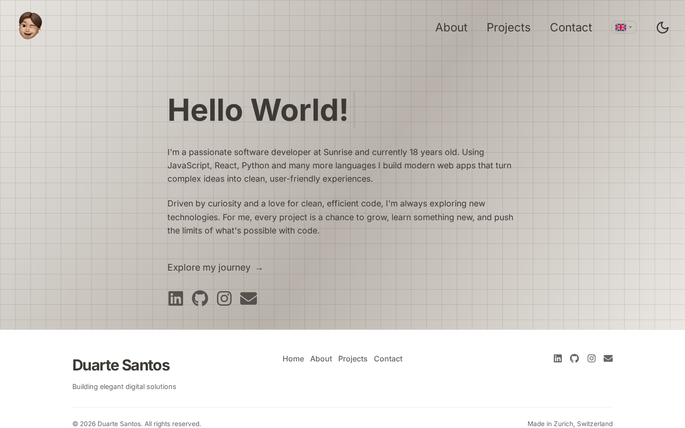
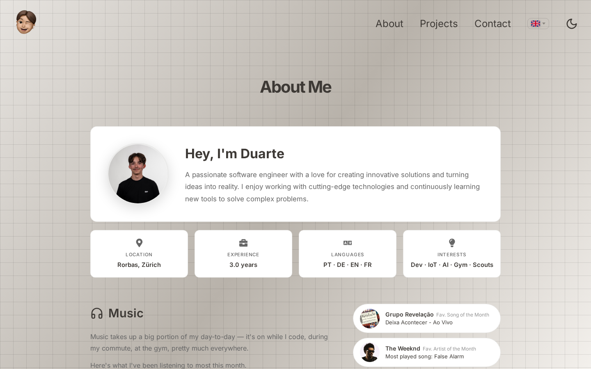
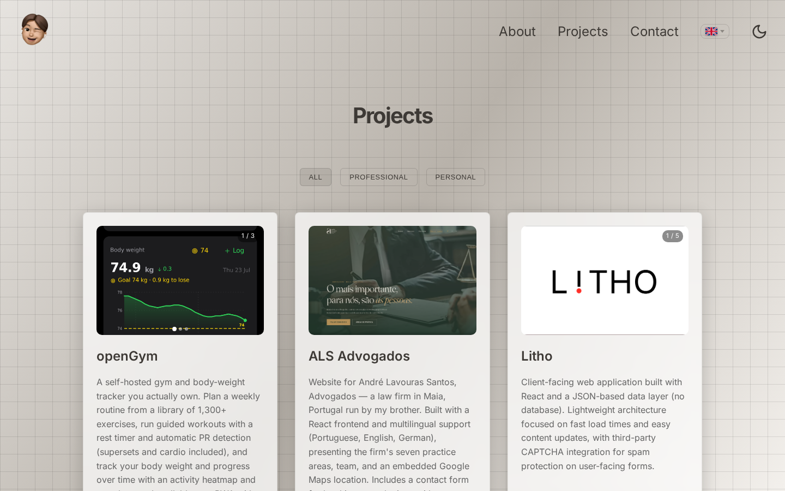
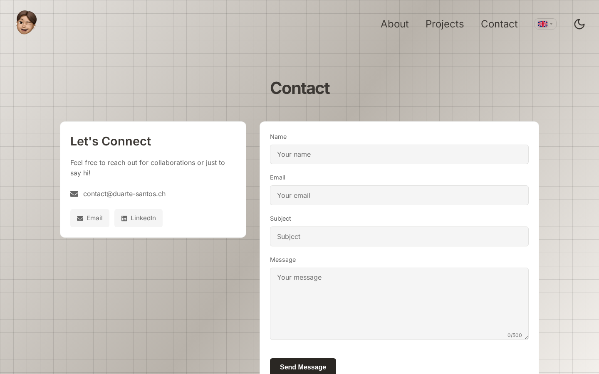
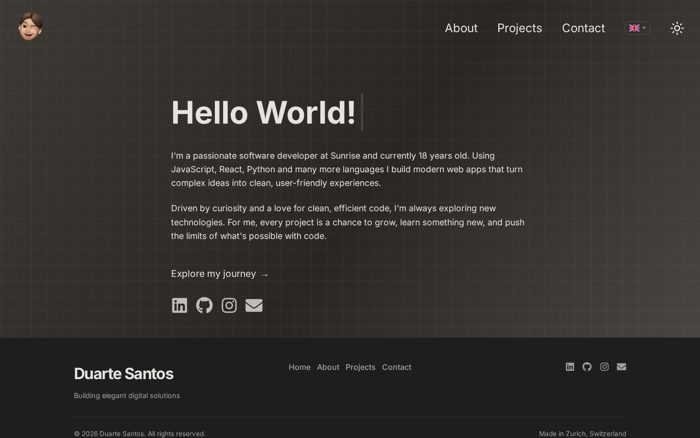
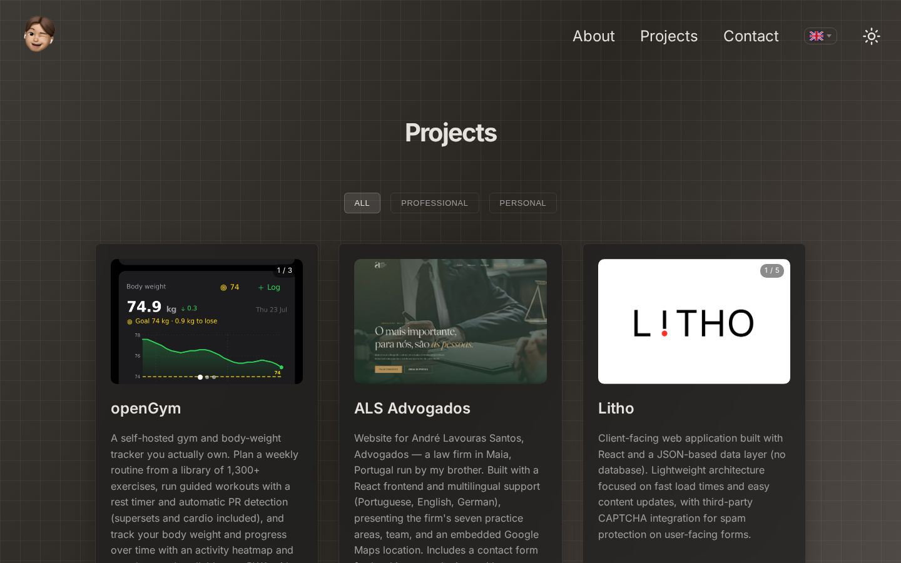
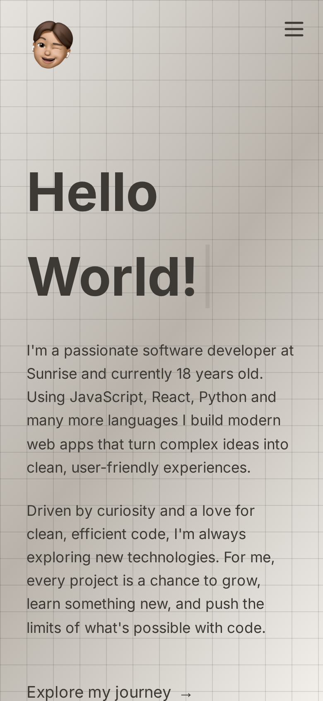
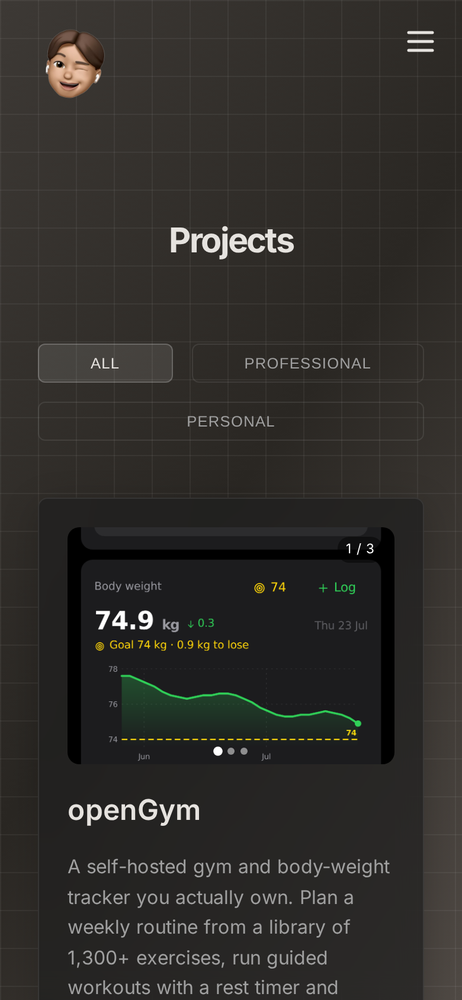

# duarte-santos.ch: Personal Portfolio

> **Building elegant digital solutions.** Made in Zurich, Switzerland 🇨🇭

The source code behind [**duarte-santos.ch**](https://duarte-santos.ch), the personal
portfolio of **Duarte Santos**, a software developer from Rorbas, Zürich, currently
working at Sunrise.

It's a single-page React app with a small Node backend, available in **English,
Portuguese and German**, with a light and a dark theme.

<p align="center">
  <a href="https://duarte-santos.ch"><strong>🌐 Visit the live site →</strong></a>
</p>



---

## What you'll find on the site

The site has four pages, reachable from the header on desktop or the burger menu on mobile.

### 🏠 Home

A short introduction: who I am, what I build, and links to
[LinkedIn](https://www.linkedin.com/in/duarte-santos-a82775328/),
[GitHub](https://github.com/DuarteSantos8),
[Instagram](https://www.instagram.com/duarte.zh/) and email.

### 👤 About

The longer version: where I'm based, how long I've been doing this, which languages I
speak, and what I'm into. Below that:

- **An experience timeline**, from the BBC Basislehrjahr (2023) through four roles at
  Sunrise GmbH: the Digital Avengers Lab, a Platform Engineer internship, the OMNI
  Platform team, and currently the CRP team.
- **A skills overview**: frontend, backend, tooling, cloud/infrastructure and operating
  systems, grouped by area.
- **A music section**: my favourite artist and song of the month, pulled live from the
  Spotify API through the backend. Music is on while I code, so it felt right to put it
  on the page.



### 💼 Projects

**14 projects**, filterable by **All / Professional / Personal**, sorted newest first.
Each card has a description, the tech stack, dates and, where it exists, a link to the
live demo or the GitHub repo. Projects with screenshots get an image carousel you can
click through, and open-source ones show their live GitHub star count.

Some of what's in there:

| Project | What it is |
|---|---|
| [**openGym**](https://opengym.ch/) | My main project: a self-hosted gym & body-weight tracker with thousands of GitHub stars, 50+ contributors and a release every two weeks. 1,300+ exercises, passkey or password login, 18 languages, an AI coach, MCP server and an Android app. Open source ([GitHub](https://github.com/DuarteSantos8/openGym)). |
| [**AgentDeck**](https://github.com/DuarteSantos8/agentdeck) | Browser terminals backed by tmux, so Claude Code agents and long jobs survive a closed tab, a dropped VPN or a restart. Open source (MIT). |
| [**ALS Advogados**](https://www.als-advogados.pt/) | Multilingual website for a law firm in Maia, Portugal. |
| [**Litho**](https://litho.ch/) | Client-facing React app on a JSON data layer, no database. |
| [**MediStock**](https://medistock.sunrise-avengers.ch/) | Equipment reservation tool for Sunrise's Multi Media Team: React, Flask REST API, MySQL. |
| [**SalesChamp**](https://saleschamp.sunrise-avengers.ch/) | Real-time points dashboard for Sunrise sales agents, Qlik analytics behind a Vue.js frontend. |
| **CIO KPI Dashboard** | Software KPI dashboard for the CIO organisation on GCP: Flask + Oracle, Chart.js frontend. |
| **Network Monitoring Dashboard** | Bash pings and Telnet port checks into InfluxDB, visualised in Grafana. |
| **Home Server: HP EliteDesk** | The Docker/Nginx/Cloudflare homelab this site runs on. |
| **TWEINT** / **WeChat** | React Native payment and messaging apps built as school projects. |
| **Arcade Machine** | A full arcade cabinet built from scratch: woodwork, wiring and all. |



### ✉️ Contact

A contact form that sends straight to my inbox via EmailJS, plus a direct email address
and a LinkedIn link if you'd rather skip the form. Messages are capped at 500 characters
and rate-limited to one every 10 minutes to keep the spam out. Send one and you get
confetti.



---

## Features

- 🌍 **Three languages**: English, Portuguese, German. All content lives in JSON/JS
  translation files, switchable from the flag picker without a reload.
- 🌗 **Light & dark theme**: follows your system preference by default, remembers your
  choice in `localStorage`.
- 🎵 **Live Spotify integration**: now-playing and top tracks, proxied through the Node
  backend so the client secret never reaches the browser.
- ⭐ **Live GitHub stars**: fetched at runtime for open-source projects.
- 🖼️ **Image carousels**: click through screenshots for each project.
- 📱 **Fully responsive**: dedicated mobile menu, layouts down to 390px.
- ✨ **Motion & polish**: parallax grid background, typing cursor, scroll-progress bar,
  fade-in-on-scroll via an `IntersectionObserver` hook, back-to-top button, Lottie
  loading animations.
- 🔍 **SEO ready**: schema.org `Person` JSON-LD, Open Graph and Twitter cards, canonical
  URL, `robots.txt` and `sitemap.xml`.

<p align="center">
  
  
</p>
<p align="center"><em>Dark mode</em></p>

<p align="center">
  
  
</p>
<p align="center"><em>Mobile</em></p>

---

## Tech stack

**Frontend**: React 19 · React Router 7 · Vite 8 · plain CSS (no framework) ·
`react-icons` · `lottie-react` · `canvas-confetti` · `@fontsource` (Inter, Roboto Mono)

**Backend**: Node.js · Express 4, serves the built SPA and proxies the Spotify API

**Email**: EmailJS (client-side, public key only)

**Deployment**: Docker multi-stage build · reverse proxy · Cloudflare Tunnel ·
self-hosted on an HP EliteDesk homelab

---

## Project structure

```
├── index.html              # SPA entry, meta tags + Person JSON-LD
├── src/
│   ├── pages/              # MainPage, AboutPage, ProjectsPage, ContactPage
│   ├── components/         # Header, Footer, MobileMenu, carousels, Spotify, …
│   ├── context/            # LanguageContext (en/pt/de), ThemeContext (light/dark)
│   ├── data/               # projectsData.json, aboutData.json  ← content lives here
│   ├── translations/       # UI strings per language
│   ├── hooks/              # useInView (scroll animations)
│   └── utils/              # loc() picks the right language out of a field
├── server/index.js         # Express: static SPA + /api/spotify/* + /healthz
├── public/                 # favicons, manifest, robots.txt, sitemap.xml, project images
└── Dockerfile              # build stage (Vite) + runtime stage (Node)
```

Adding a project means adding one object to `src/data/projectsData.json`, no component
changes needed.

---

## Running it locally

```bash
git clone https://github.com/DuarteSantos8/portfolio.git
cd portfolio
npm install

cp .env.example .env      # fill in what you need, see below
npm run dev               # Vite on :3000 + API server on :8080
```

| Script | What it does |
|---|---|
| `npm run dev` | Vite dev server **and** the Node API together |
| `npm start` | Vite dev server only (`http://localhost:3000`) |
| `npm run server` | Node API only (`http://localhost:8080`) |
| `npm run build` | Production build into `dist/` |
| `npm run preview` | Serve the production build locally |

Everything works without any environment variables. The contact form and the music
section simply stay inactive.

### Environment variables

```ini
# Build-time: inlined into the public bundle, so public values only
VITE_EMAILJS_SERVICE_ID=
VITE_EMAILJS_TEMPLATE_ID=
VITE_EMAILJS_PUBLIC_KEY=

# Runtime, server-only: never prefix these with VITE_
SPOTIFY_CLIENT_ID=
SPOTIFY_CLIENT_SECRET=
SPOTIFY_REFRESH_TOKEN=
```

The `VITE_` prefix is what decides whether a value ends up in the browser bundle. The
Spotify credentials deliberately don't have it: they're read at runtime by
`server/index.js`, and the frontend only ever talks to `/api/spotify/*`. Without them
those endpoints return `204` and the music section stays empty.

### Docker

```bash
docker build -t duarte-portfolio .
docker run -p 8080:8080 --env-file .env duarte-portfolio
```

The image builds the SPA with Vite and serves it from the Node server on port `8080`.
`GET /healthz` returns `OK` for health checks.

---

## Get in touch

- 🌐 [duarte-santos.ch](https://duarte-santos.ch)
- 💼 [LinkedIn](https://www.linkedin.com/in/duarte-santos-a82775328/)
- 🐙 [GitHub](https://github.com/DuarteSantos8)
- ✉️ [contact@duarte-santos.ch](mailto:contact@duarte-santos.ch)

---

<sub>The code is public so you can see how the site is put together. The written content,
photos and project screenshots are my own, please don't reuse them as your own portfolio.</sub>
